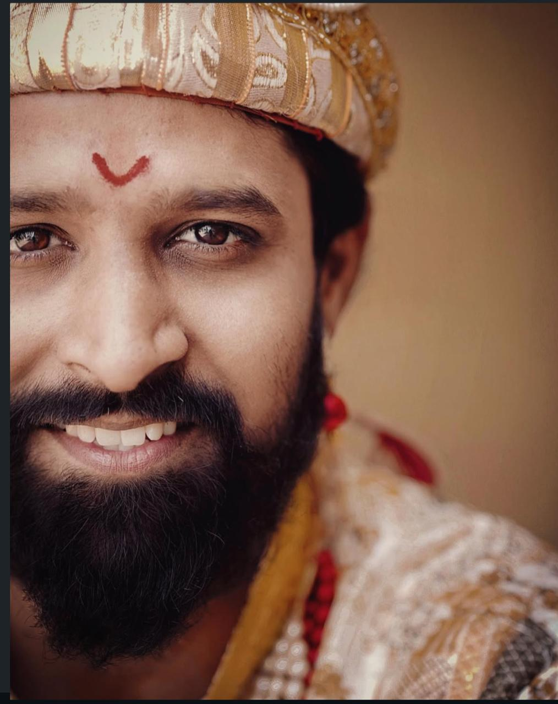

<!DOCTYPE html>
<html lang="mr">
<head>
    <meta charset="UTF-8">
    <meta name="viewport" content="width=device-width, initial-scale=1.0">
    <title>Anirudha Devdikar - Actor | Marathi Cinema</title>
    <link href="https://fonts.googleapis.com/css2?family=Poppins:wght@300;400;600;700&family=Hind:wght@400;500;600;700&display=swap" rel="stylesheet">
    <link rel="stylesheet" href="https://cdnjs.cloudflare.com/ajax/libs/font-awesome/6.4.0/css/all.min.css">
    
<base target="_blank">
</head>
<body>

    <!-- Navigation -->
    <nav id="navbar">
        <ul>
            <li><a href="#home"><i class="fas fa-home"></i> होम</a></li>
            <li><a href="#about"><i class="fas fa-user"></i> माहिती</a></li>
            <li><a href="#photos"><i class="fas fa-camera"></i> फोटो</a></li>
            <li><a href="#projects"><i class="fas fa-film"></i> प्रोजेक्ट्स</a></li>
            <li><a href="#audition"><i class="fas fa-video"></i> ऑडिशन</a></li>
            <li><a href="#contact"><i class="fas fa-phone"></i> संपर्क</a></li>
        </ul>
    </nav>

    <!-- Hero Section -->
    <section class="hero" id="home">
        

            
            <h1>अनिरुद्ध देवडीकर</h1>
            
Anirudha Devdikar

            
🎭 अभिनेता | वय: 29 | पुणे, महाराष्ट्र

            

                <a href="#projects" class="btn"><i class="fas fa-play"></i> माझे काम पहा</a>
                <a href="#contact" class="btn btn-outline"><i class="fas fa-envelope"></i> संपर्क करा</a>
            

        

    </section>

    <!-- Stats Bar -->
    

        

            <h3>4+</h3>
            
वेबसिरीज

        

        

            <h3>2+</h3>
            
मराठी चित्रपट

        

        

            <h3>5+</h3>
            
अल्बम गाणी

        

        

            <h3>10+</h3>
            
कौशल्ये

        

    

    <!-- About Section -->
    <section id="about" class="about">
        <h2><i class="fas fa-user-circle"></i> माझी ओळख</h2>
        

            

                
नमस्कार, मी अनिरुद्ध देवडीकर. मराठी चित्रपटसृष्टीतील एक उत्सुक अभिनेता. मी विनम्र स्वभावाचा आणि लवचिक व्यक्तिमत्वाचा धनी आहे.

                
मी मुक्ती, वन टू का फोर, अ‍ॅक्टर्स आणि बॅशिंग या लोकप्रिय वेबसिरीजमध्ये काम केले आहे. धर्मरक्षक अहिल्यादेवी होळकर आणि सजना या मराठी चित्रपटांमध्ये महत्त्वाच्या भूमिका साकारल्या आहेत.

                
विशेष कौशल्ये:

                

                    <i class="fas fa-fire"></i> Real Stunt
                    <i class="fas fa-hand-fist"></i> Real Fight
                    <i class="fas fa-swimmer"></i> Swimming
                    <i class="fas fa-horse"></i> Horse Riding
                    <i class="fas fa-car"></i> Driving
                    <i class="fas fa-bicycle"></i> Cycling
                    <i class="fas fa-baseball-ball"></i> Cricket
                    <i class="fas fa-futbol"></i> Football
                

            

            

                
            

        

    </section>

    <!-- Photo Gallery -->
    <section id="photos" class="gallery">
        <h2><i class="fas fa-images"></i> फोटो गॅलरी</h2>
        

            

                
                <i class="fas fa-expand"></i>
                

                    <strong>Portfolio Shot</strong> 
                    <small>Professional</small>
                

            

            

                
                <i class="fas fa-expand"></i>
                

                    <strong>Action Look</strong> 
                    <small>Bike Shoot</small>
                

            

            

                
                <i class="fas fa-expand"></i>
                

                    <strong>Artistic</strong> 
                    <small>Black & White</small>
                

            

            

                
                <i class="fas fa-expand"></i>
                

                    <strong>Vintage Look</strong> 
                    <small>Traditional</small>
                

            

            

                
                <i class="fas fa-expand"></i>
                

                    <strong>Intense</strong> 
                    <small>Character</small>
                

            

            

                
                <i class="fas fa-expand"></i>
                

                    <strong>Close Up</strong> 
                    <small>Expression</small>
                

            

            

                
                <i class="fas fa-expand"></i>
                

                    <strong>Rural Style</strong> 
                    <small>Village</small>
                

            

            

                
                <i class="fas fa-expand"></i>
                

                    <strong>Traditional</strong> 
                    <small>Ethnic Wear</small>
                

            

            

                
                <i class="fas fa-expand"></i>
                

                    <strong>Royal Character</strong> 
                    <small>Historical</small>
                

            

        

    </section>

    <!-- Projects Section -->
    <section id="projects" class="projects">
        <h2><i class="fas fa-film"></i> माझे प्रोजेक्ट्स</h2>

        

            <h3>🎬 वेबसिरीज</h3>
            

                

                    

                        <i class="fas fa-play play-btn"></i>
                    

                    

                        वेबसिरीज
                        <h4>मुक्ती (Mukti)</h4>
                        
मुख्य भूमिका

                        <a href="https://youtu.be/VKy5G3M5HBg" target="_blank" class="watch-btn">
                            <i class="fab fa-youtube"></i> पहा
                        </a>
                    

                

                

                    

                        <i class="fas fa-play play-btn"></i>
                    

                    

                        वेबसिरीज
                        <h4>वन टू का फोर</h4>
                        
मुख्य भूमिका

                        <a href="https://youtu.be/KeqDqxl6Hm0" target="_blank" class="watch-btn">
                            <i class="fab fa-youtube"></i> पहा
                        </a>
                    

                

                

                    

                        <i class="fas fa-play play-btn"></i>
                    

                    

                        वेबसिरीज
                        <h4>अ‍ॅक्टर्स (Actors)</h4>
                        
जलिंदर कुंभार सर

                        
मुख्य भूमिका

                        <a href="https://youtu.be/C7xbLRCRbEM" target="_blank" class="watch-btn">
                            <i class="fab fa-youtube"></i> पहा
                        </a>
                    

                

                

                    

                        <i class="fas fa-play play-btn"></i>
                    

                    

                        वेबसिरीज
                        <h4>बॅशिंग (Bashing)</h4>
                        
योगेश गडगे

                        
मुख्य भूमिका

                        <a href="https://youtu.be/DOKvfjyqmUI" target="_blank" class="watch-btn">
                            <i class="fab fa-youtube"></i> पहा
                        </a>
                    

                

            

        

        

            <h3>🎞️ मराठी चित्रपट</h3>
            

                

                    

                        <i class="fas fa-crown play-btn"></i>
                    

                    

                        चित्रपट
                        <h4>धर्मरक्षक अहिल्यादेवी होळकर</h4>
                        
सुशांत सोनवले सर

                        
सरसेनापती बर्गळ

                    

                

                

                    

                        <i class="fas fa-running play-btn"></i>
                    

                    

                        चित्रपट
                        <h4>सजना (Sajana)</h4>
                        
प्रतिस्पर्धी भूमिका

                    

                

            

        

    </section>

    <!-- Other Work -->
    <section class="other-work">
        <h2><i class="fas fa-music"></i> इतर कामे</h2>
        

            

                <i class="fas fa-compact-disc"></i>
                <h3>अल्बम गाणी</h3>
                
4-5 अल्बम गाण्यांमध्ये पार्श्वभूमी नर्तक

            

            

                <i class="fas fa-star"></i>
                <h3>विशेष कौशल्ये</h3>
                
Stunt, Fight, Sports

            

            

                <i class="fas fa-theater-masks"></i>
                <h3>अभिनय शैली</h3>
                
विनम्र स्वभाव, लवचिक

            

        

    </section>

    <!-- Audition Section -->
    <section id="audition" class="audition">
        <h2><i class="fas fa-video"></i> Casting Directors</h2>
        

            <h3>🎥 Showreel Links</h3>
            
माझे सर्व प्रोजेक्ट्सचे लिंक्स:

            

                <a href="https://youtu.be/VKy5G3M5HBg" target="_blank" class="reel-link">
                    <i class="fab fa-youtube"></i> मुक्ती
                </a>
                <a href="https://youtu.be/KeqDqxl6Hm0" target="_blank" class="reel-link">
                    <i class="fab fa-youtube"></i> वन टू का फोर
                </a>
                <a href="https://youtu.be/C7xbLRCRbEM" target="_blank" class="reel-link">
                    <i class="fab fa-youtube"></i> अ‍ॅक्टर्स
                </a>
                <a href="https://youtu.be/DOKvfjyqmUI" target="_blank" class="reel-link">
                    <i class="fab fa-youtube"></i> बॅशिंग
                </a>
            

            

                

                    <h4>वय</h4>
                    
29

                

                

                    <h4>उंची</h4>
                    
5'8"

                

                

                    <h4>भाषा</h4>
                    
मराठी, हिंदी

                

                

                    <h4>ठिकाण</h4>
                    
पुणे

                

            

            

                <strong style="color: var(--accent-color);">स्टंट, स्विमिंग, हॉर्स राइडिंग, ड्रायव्हिंग, स्पोर्ट्स</strong>
            

        

    </section>

    <!-- Contact -->
    <section id="contact" class="contact">
        <h2><i class="fas fa-address-card"></i> संपर्क</h2>
        
नवीन प्रोजेक्ट्ससाठी मला संपर्क करा

        

            

                <i class="fas fa-envelope"></i>
                

                    anidevadikar008@gmail.com
                

            

            

                <i class="fas fa-phone"></i>
                

                    +91 98902 24073
                

            

            

                <i class="fas fa-map-marker-alt"></i>
                

                    पुणे, महाराष्ट्र
                

            

        

        

            <a href="#"><i class="fab fa-instagram"></i></a>
            <a href="#"><i class="fab fa-facebook-f"></i></a>
            <a href="#"><i class="fab fa-youtube"></i></a>
            <a href="#"><i class="fab fa-whatsapp"></i></a>
        

    </section>

    <footer>
        
&copy; 2024 अनिरुद्ध देवडीकर. सर्व हक्क राखीव.

    </footer>

    <!-- Lightbox -->
    

        &times;
        
    

    <!-- Scroll to Top -->
    

        <i class="fas fa-arrow-up"></i>
    

    

</body>
</html>
    </script>

</body>
</html>
